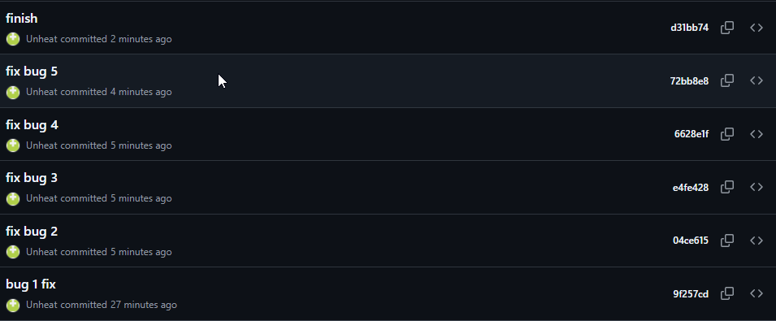

## AI Usage

I used Claude Code throughout this project as a mentor, not as a code writer — I asked it up front to guide me with questions and point me at the right files instead of fixing bugs for me directly.

**Codebase orientation:** Had it walk through `app.py`, the `routes/` and `services/` structure, and README.md/homework.md with me so I understood the routes-call-services pattern before touching any issue.

**Issue #2 (feed):** Asked it to write a small exploratory pytest test (`test_feed.py`) so I could see how `get_friends_listening_now(user_id)` is actually called, since it takes no injectable "now" like `update_listening_streak` does. It was useful for showing me the function signature, but it also caught a mistake in my own reasoning: my first test used generic values (5 minutes / 3 days) that would pass under almost any threshold, so "all tests passing" didn't actually prove my fix (`RECENT_THRESHOLD = 30 minutes`) was correct — a 3-day-old event fails under a 24-hour threshold *and* a 30-minute one, so it can't distinguish "fixed" from "still broken." It pointed out I needed a test at the actual boundary between the two thresholds (something older than 30 minutes but younger than 24 hours) to really confirm the fix, which is why I added a 2-hour-old case afterward.

**Issue #3 (search duplicates) — where I initially got it wrong:** I assumed the bug was the `outerjoin` on `song_tags` fanning out into duplicate rows for songs with multiple tags. I asked it to check this, and it ran the query directly — compiled the ORM query to raw SQL (confirmed the join really does produce 3 rows for a 3-tag song), then ran the same call through `db.session.query(Song).all()` vs. the newer `select(Song).scalars().all()` API. That comparison showed the legacy `Query` API silently deduplicates the 3 rows down to 1 by primary key, while the modern `select()`/`scalars()` API returns all 3 unmodified. My first-pass conclusion (in an earlier draft of this doc) was that this made the report a "false negative," since the existing test suite — which calls `search_songs()`, which uses the legacy `Query` API — passes either way. That conclusion was too quick: a passing test only proves the test doesn't exercise the failing path, not that no bug exists. Going back with that in mind, I re-read the query and realized the join was never used to filter or select anything — it existed purely as a latent landmine that any future switch to the modern SQLAlchemy API (which the project is clearly migrating toward, given `song_tags` is otherwise unused in the filter) would trigger into a real, user-visible duplicate. I removed the join and wrote a regression test that inspects the actual SQL statement the function sends, rather than trusting `.all()`'s incidental behavior. Where I had to verify things myself: I didn't take the AI's "your test proves it's fine" framing at face value a second time — I had it show me the raw SQL and the two APIs side by side before accepting any conclusion, in either direction.

**Issue #4 (notifications):** Asked it to help me compare `add_to_playlist()` and `rate_song()` in `notification_service.py` line by line rather than telling me the answer. It asked what `create_notification()` call I could find in `rate_song()` (there wasn't one), which led me to write the fix myself. After I wrote it, I asked it to check my fix — it caught that I'd copy-pasted `notification_type="song_added_to_playlist"` instead of a rating-specific type, which I then had to fix myself.

**Issue #5 (playlist):** Asked it to explain what `songs[:-1]` does in Python (slice notation dropping the last element) since I wasn't 100% sure of the syntax. It also pointed out the function's own docstring said "returns all songs in the playlist," which directly contradicted the slice — that mismatch is what confirmed the root cause for me.

## Codebase Map

```
ai201-project5-mixtape-starter/
├── app.py                      # Flask app factory: configures the DB, registers all route blueprints, calls db.create_all()
├── models.py                   # SQLAlchemy models: User, Tag, Song, ListeningEvent, Rating, Playlist, Notification, plus 3 association tables
├── routes/                     # Thin HTTP layer — parses request data, calls one service function, formats the JSON response
│   ├── songs.py                # /songs — search, get, rate, listen
│   ├── playlists.py            # /playlists — create, get, list songs, add song
│   ├── users.py                # /users — profile, streak, notifications
│   └── feed.py                 # /feed — friends listening now, activity feed
├── services/                   # All business logic and DB queries live here; routes never touch db.session directly (except users.py's simple get-by-id)
│   ├── streak_service.py       # Listening streak increment/reset logic
│   ├── feed_service.py         # "Friends listening now" recency filter + general activity feed
│   ├── search_service.py       # Song search by title/artist
│   ├── notification_service.py # Notification creation/retrieval; also owns add_to_playlist() and rate_song()
│   └── playlist_service.py     # Playlist creation and ordered song retrieval
├── tests/
│   ├── test_streaks.py
│   ├── test_search.py
│   ├── test_playlists.py
│   └── test_feed.py            # added while investigating Issue #2
├── seed_data.py                # Populates DB with test data (users, songs w/ varying tag counts, playlists, listening events, ratings)
├── requirements.txt
└── .gitignore
```

**Models worth calling out:** `song_tags`, `playlist_entries`, and `friendships` are all explicit association tables rather than plain `secondary=` many-to-many. `playlist_entries` in particular carries extra columns (`position`, `added_by`, `added_at`) — a song's place in a playlist is an explicit, ordered fact, not just insertion order, which is exactly what `playlist_service.get_playlist_songs()` orders by. `Rating` has a `UniqueConstraint(user_id, song_id)`, so a user can only have one rating per song — `rate_song()` has to branch on whether a rating already exists (update) or not (insert) rather than just always inserting.

**Pattern noticed:** every route function does argument parsing/validation and response formatting only; every actual query and mutation happens in `services/`. The one exception is `routes/users.py::get_user`, which does a direct `db.session.get(User, user_id)` — a simple enough lookup that it didn't get its own service function.

**Data flow — a friend adds my shared song to a playlist:**
`POST /playlists/<id>/songs` (`routes/playlists.py::add_song`) parses `song_id`/`added_by` and calls `notification_service.add_to_playlist(playlist_id, song_id, added_by_user_id)`. That function loads the `Song`, `User`, and `Playlist` by ID (raising `ValueError` → 400 if any is missing), appends the song to `playlist.songs` if it isn't already present (writing a row into `playlist_entries` via the ORM relationship) and commits. Only then does it check `song.shared_by != added_by_user_id` — if the person adding the song isn't the person who originally shared it, it calls `create_notification()`, which writes a new `Notification` row for the original sharer. There's no separate "activity" model — notifications are just rows in one `Notification` table distinguished by `notification_type`.

**Data flow — friends listening now:**
`GET /feed/<user_id>/listening-now` (`routes/feed.py::listening_now`) calls `feed_service.get_friends_listening_now(user_id)`. That function loads the user, reads `user.friends` (via the `friendships` association table) to get a list of friend IDs, computes `cutoff = now - RECENT_THRESHOLD`, and queries `ListeningEvent` rows for those friends with `listened_at >= cutoff`, newest first. It then walks that list and keeps only the first (i.e. most recent) event per friend, so a friend who's played three songs in the window only shows up once, with their latest song. `RECENT_THRESHOLD` is what defines "now" for this feature (see Issue #2 below) — it's a separate, unrelated concept from `get_activity_feed()` in the same file, which deliberately ignores recency entirely and just returns the last N events.

## Root Cause Analyses

### Issue #1: My listening streak keeps resetting

**How you reproduced it**

Ran `pytest tests/test_streaks.py -v`. `test_streak_increments_on_sunday` failed: after listening on Saturday (streak = 1) and then on Sunday (one day later), the streak should become 2 but stayed at 1.

**How you found the root cause**

Re-ran just that test with `pytest tests/test_streaks.py::test_streak_increments_on_sunday --pdb` so it drops into the debugger at the failure point, then stepped back into `update_listening_streak()` (called from `record_listening_event()`) and inspected `days_since_last` and `today.weekday()` at the moment the Sunday call runs: `days_since_last == 1` and `today.weekday() == 6`. That's the exact pair of values the `elif` branch checks, which is what confirmed I'd found the real condition and not just "somewhere in the streak logic."

**The root cause**

The increment branch read `elif days_since_last == 1 and today.weekday() != 6:`. Python's `date.weekday()` returns `6` for Sunday, so this condition means "increment only if exactly one day has passed *and* today isn't Sunday." Any listen that lands exactly one day after the previous one, but happens to fall on a Sunday, fails that condition and falls through to the `else` branch (`user.listening_streak = 1`), which is meant for *skipped* days — resetting a streak that should have incremented. Nothing in the function's own docstring ("if the user listened yesterday: streak increments by 1") calls for a Sunday exception; the `!= 6` clause has no basis in the stated rules and doesn't correspond to any real product requirement (e.g. a "week resets on Sunday" rule would need to compare *dates*, not skip incrementing on one specific weekday).

**Your fix and side-effect check**

Removed the `and today.weekday() != 6` clause, leaving `elif days_since_last == 1: user.listening_streak += 1`. Re-ran all of `test_streaks.py`: the new-user, same-day-no-double-count, skipped-day-reset, and consecutive-day cases all still pass, in addition to the Sunday case now passing — confirming the removed clause wasn't silently protecting any other scenario, since nothing else in `streak_service.py` (or any caller of `record_listening_event`) touches `weekday()`.

---

### Issue #2: Friends Listening Now shows people from yesterday

**How you reproduced it**

Wrote `tests/test_feed.py` to call `get_friends_listening_now()` directly with a friend's `ListeningEvent.listened_at` set to 3 days in the past. The function returned that friend as currently listening, when it should have returned `[]`.

**How you found the root cause**

In `feed_service.py`, `get_friends_listening_now()` builds `cutoff = datetime.now(timezone.utc) - RECENT_THRESHOLD` and filters `ListeningEvent.listened_at >= cutoff`. `RECENT_THRESHOLD` was defined at the top of the file as `timedelta(hours=24)`. I cross-checked this against `seed_data.py`, which seeds listening events at specific ages (minutes-old and hours-old) clearly meant to straddle a much tighter "currently listening" window than 24 hours — that mismatch between the seeded data's intent and the actual threshold constant is what told me the threshold itself, not the query logic around it, was the bug.

**The root cause**

`RECENT_THRESHOLD` was set to `timedelta(hours=24)` instead of `timedelta(minutes=30)`. "Friends Listening Now" is a live-presence feature — it's supposed to show only friends who are listening in roughly the current moment, not anyone who listened at any point in the last day. With a 24-hour cutoff, a friend who listened once yesterday afternoon is still "recent" relative to right now, so they kept appearing in the feed long after they'd stopped listening, which is exactly the "shows people from yesterday" symptom in the bug report.

**Your fix and side-effect check**

Changed `RECENT_THRESHOLD` to `timedelta(minutes=30)`. Verified `test_recent_friend_listen_shows_up` (a 5-minute-old event still appears) still passes, and added `test_yesterday_friend_listen_does_not_show_up`, which uses a 2-hour-old event specifically because that's the one value that actually distinguishes the two thresholds — it would incorrectly show up under the old 24-hour threshold but is correctly excluded under 30 minutes (the pre-existing 3-day-old test fails under either threshold, so it never would have caught this bug on its own). I also checked `get_activity_feed()`, the other function in the same file that queries `ListeningEvent` — its docstring explicitly says it's "not filtered by recency," and it doesn't reference `RECENT_THRESHOLD` at all, so the fix has no effect on it.

---

### Issue #3: The same song keeps showing up twice in search

**How you reproduced it**

The provided `test_search_no_duplicates_multi_tag_song` passed against the unmodified code, so I didn't stop there — I suspected a false negative in the *test*, not the *bug report*. I directly executed the same join `search_songs()` builds (`Song` outer-joined to `song_tags`, filtered by title) as raw SQL against a 3-tagged fixture song, and got back 3 rows with the same `song_id` — confirming the join really does fan out at the database level, even though the existing pytest test doesn't observe it.

**How you found the root cause**

In `search_service.py`, `search_songs()` runs `db.session.query(Song).outerjoin(song_tags, Song.id == song_tags.c.song_id).filter(...).all()` — but the filter only checks `Song.title`/`Song.artist`, never anything from `song_tags`. The join exists but does no filtering or selecting work. I compared the exact same filter run two ways: `db.session.query(Song)...all()` (what the code actually uses) returned 1 `Song` for the 3-tagged fixture; `db.session.execute(select(Song)...).scalars().all()` (SQLAlchemy's modern 2.0-style API) returned 3 duplicate `Song` objects for the identical filter. That side-by-side comparison was the moment I was confident I had the real mechanism, not just a suspicious join: the legacy `Query.all()` API silently deduplicates full-entity results by primary key as a backward-compatibility behavior, and the existing test suite only ever calls `search_songs()` through that API — so it can't see the fan-out that the join is capable of producing.

**The root cause**

`search_songs()` joins `Song` to `song_tags` even though tags are never part of the search filter. For a song tagged N times, that join emits N identical rows for the same song (one per matching `song_tags` row) — a standard SQL join fan-out. The bug is "conditional" exactly as the assignment hinted: whether that fan-out is visible depends on which SQLAlchemy execution path materializes the query, not on the query itself. The installed version's legacy `db.session.query(Song).all()` happens to auto-unique full-entity rows by primary key, so the fan-out is currently invisible to callers and to the test suite — but it's an implementation detail of that one API, not a property of the query. The identical filter run through `session.execute(select(Song)...).scalars().all()` (the API SQLAlchemy's own docs steer new code toward) returns the duplicates unmodified, so the moment this code — or a copy of its query pattern — is touched by a routine API modernization, the "same song twice" bug becomes real and user-visible again.

**Your fix and side-effect check**

Removed the `.outerjoin(song_tags, Song.id == song_tags.c.song_id)` call entirely, since it was never used to filter or select anything — search only ever matches on title/artist. Removed the now-unused `Tag`/`song_tags` imports. Added `tests/test_search.py::test_search_does_not_join_song_tags_table`, which attaches a SQLAlchemy `before_cursor_execute` listener to capture the actual SQL `search_songs()` sends and asserts the main filter query never references `song_tags`, so this can't come back regardless of which SQLAlchemy API a future refactor uses (this test would fail immediately if the join were re-added, unlike the original test). Checked that tags still render correctly in results — `Song.tags` is loaded through a separate `lazy="subquery"` relationship independent of this join, and it issues its own (legitimate) join to `song_tags` to batch-load tags for the matched songs, which the new test explicitly excludes from its check. Ran the full `test_search.py` suite (6 tests, including the 5 pre-existing ones) and the full project suite (17 tests) — all pass.

---

### Issue #4: I got notified when a friend added my song to a playlist but not when they rated it

**How you reproduced it**

No test file was provided for notifications, so I read `notification_service.py` directly and traced both call paths: `add_to_playlist()` (`routes/playlists.py::add_song`) and `rate_song()` (`routes/songs.py::rate`). Calling `rate_song()` for a song rated by someone other than its sharer completed successfully and saved the `Rating`, but produced no `Notification` row, while the equivalent playlist-add flow did.

**How you found the root cause**

Compared `add_to_playlist()` and `rate_song()` line by line in `notification_service.py`. Both functions look up the acting user and the target `Song`, and both end with the same shape of guard — `if song.shared_by != <acting_user_id>:` — meant to skip notifying someone about their own action. In `add_to_playlist()`, that guard is followed by a `create_notification(...)` call. In `rate_song()`, the function ends right after `db.session.commit()` for the rating — there is no `create_notification()` call anywhere in the function, guarded or not.

**The root cause**

This isn't a typo or an off condition — the entire notification step is architecturally missing from `rate_song()`. Both flows are meant to follow the same pattern ("a friend interacts with my shared song → check they're not the sharer → notify the sharer"), but that second half of the pattern was never implemented when `rate_song()` was written, even though the rating itself is persisted correctly.

**Your fix and side-effect check**

Added a `create_notification(user_id=song.shared_by, notification_type="song_rated", body=f"{rater.username} rated your song '{song.title}' with {score} stars.")` call at the end of `rate_song()`, gated by the same `song.shared_by != user_id` check `add_to_playlist()` uses, so sharers don't get notified about rating their own songs. Used a distinct `notification_type` (`"song_rated"`) rather than reusing `"song_added_to_playlist"`, so `get_notifications()` consumers can tell the two kinds of notification apart. Verified by calling `rate_song()` as a non-sharer and confirming a new row appears via `get_notifications()`, then rating as the sharer and confirming no notification is created. Also re-ran the `add_to_playlist()` flow to confirm it's untouched.

---

### Issue #5: The last song in a playlist never shows up

**How you reproduced it**

Ran `pytest tests/test_playlists.py -v` with a 5-song seeded playlist; `test_playlist_returns_all_songs` failed — `get_playlist_songs()` returned 4 songs instead of 5.

**How you found the root cause**

Used `pytest tests/test_playlists.py::test_playlist_returns_all_songs --pdb` to break at the failure and inspect `get_playlist_songs()` in `playlist_service.py`. The query above the return statement (`db.session.query(Song).join(playlist_entries,...).filter(...).order_by(asc(position)).all()`) already produced all 5 songs in the correct order when I inspected `songs` directly in the debugger — so the query itself wasn't the problem, which pointed me at the return line: `return [song.to_dict() for song in songs[:-1]]`.

**The root cause**

`songs[:-1]` is a Python slice that returns every element except the last one. The query correctly fetches all songs ordered by position, but the return statement then unconditionally drops the final entry before handing the list back — so whichever song currently occupies the last playlist position never appears in the output, for every playlist regardless of size. The function's own docstring ("returns all songs in the playlist") directly contradicts what the code does, which is what confirmed this was the actual bug rather than a query ordering issue.

**Your fix and side-effect check**

Changed `songs[:-1]` to `songs`. Verified `test_playlist_returns_all_songs` (count is now 5) and `test_playlist_returns_songs_in_order` (order includes `"Track 5"` as the last element) both pass, and re-checked `test_empty_playlist_returns_empty_list` — an empty list sliced with `[:-1]` was already `[]`, so that edge case wasn't masking anything and the fix doesn't change its behavior.

## Regression Tests

- `tests/test_feed.py::test_yesterday_friend_listen_does_not_show_up` (Issue #2) — a 2-hour-old listening event is the boundary value that actually distinguishes the buggy 24-hour threshold from the correct 30-minute one; it would have failed against the original `RECENT_THRESHOLD = timedelta(hours=24)`.
- `tests/test_search.py::test_search_does_not_join_song_tags_table` (Issue #3) — captures the real SQL `search_songs()` executes and asserts it never joins `song_tags`; it would have failed against the original `.outerjoin(song_tags, ...)` call regardless of which SQLAlchemy API is used to run the query, unlike the pre-existing duplicate-count test.

### commit for each bug fix



*(Screenshot above reflects the commit history before the Issue #3 fix and commit-message cleanup — regenerate `git log --oneline` after the final commits below.)*
